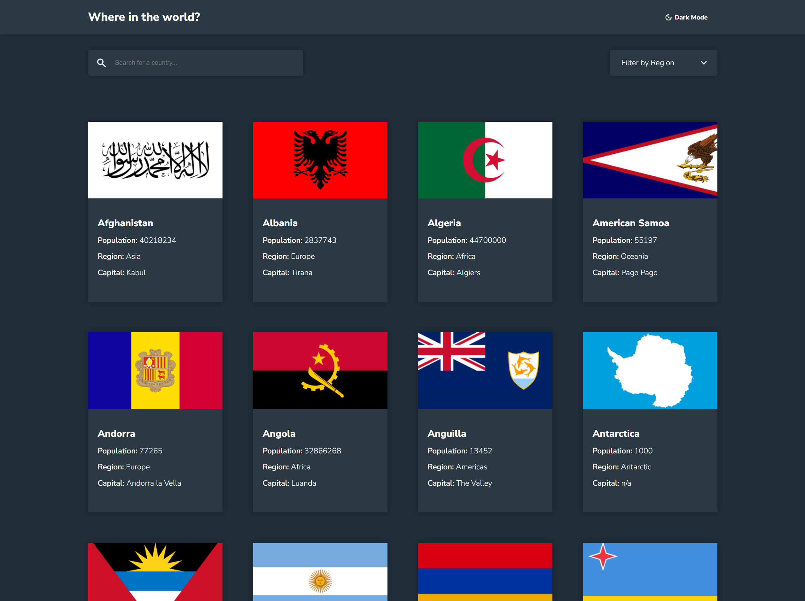

# Frontend Mentor - REST Countries API with color theme switcher solution

This is a solution to the [REST Countries API with color theme switcher challenge on Frontend Mentor](https://www.frontendmentor.io/challenges/rest-countries-api-with-color-theme-switcher-5cacc469fec04111f7b848ca). Frontend Mentor challenges help you improve your coding skills by building realistic projects.

## Table of contents

-   [Overview](#overview)
    -   [The challenge](#the-challenge)
    -   [Screenshot](#screenshot)
    -   [Links](#links)
-   [My process](#my-process)
    -   [Built with](#built-with)
    -   [What I learned](#what-i-learned)
    -   [Continued development](#continued-development)
    -   [Useful resources](#useful-resources)
-   [Author](#author)

## Overview

### The challenge

Users should be able to:

-   See all countries from the API on the homepage
-   Search for a country using an `input` field
-   Filter countries by region
-   Click on a country to see more detailed information on a separate page
-   Click through to the border countries on the detail page
-   Toggle the color scheme between light and dark mode _(optional)_
-   **Bonus:** Toggle the color scheme between light and dark mode

### Screenshot

### Links

-   Solution URL: [https://github.com/blakelyons/frontend-mentor-rest-countries](https://github.com/blakelyons/frontend-mentor-rest-countries)
-   Live Site URL: [https://frontend-mentor-rest-countries.pages.dev/](https://frontend-mentor-rest-countries.pages.dev/)

## My process

### Built with

-   Semantic HTML5 markup
-   CSS custom properties
-   Flexbox
-   CSS Grid
-   Mobile-first workflow
-   [Vue](https://vuejs.org/guide/introduction.html) - JS library
-   [Skeleton Elements](https://skeleton-elements.nolimits4web.com/) - UI for Skeleton Loading Elements
-   [Sass](https://sass-lang.com) - For styles
-   [REST Countries API](https://restcountries.com/) - API for Countries Data

### What I learned

I learned more about working with [Pinia](https://pinia.vuejs.org/) for storing data to access between components.

### Continued development

I want to continue to focus on digging deeper into State Managment using Pinia as well as refining my knowledge of Vue 3 Composition API.

### Useful resources

-   [Kevin Powell YouTube Channel](https://www.youtube.com/@KevinPowell) - Kevin's YouTube channel has been entertaining and informative to watch. His channel has opened my eyes to new ways to code CSS.

## Author

-   Website - [Blake Lyons](https://www.blakelyons.com)
-   Frontend Mentor - [@blakelyons](https://www.frontendmentor.io/profile/blakelyons)
-   Twitter - [@blakelyons](https://www.twitter.com/blakelyons)
